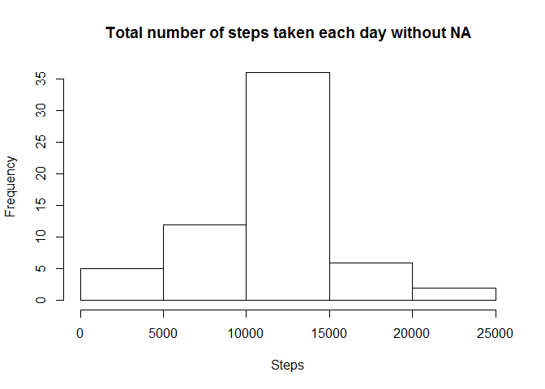

# PA1_template
Iwo Augustynski  
Friday, March 25, 2016  
## Data


The data for this assignment can be downloaded from the course web site:

Dataset: [Activity monitoring data [52K]](https://d396qusza40orc.cloudfront.net/repdata%2Fdata%2Factivity.zip)

The variables included in this dataset are:

   1. **steps**: Number of steps taking in a 5-minute interval (missing values are coded as NA)

   2. **date**: The date on which the measurement was taken in YYYY-MM-DD format

   3. **interval**: Identifier for the 5-minute interval in which measurement was taken
    

The dataset is stored in a comma-separated-value (CSV) file and there are a total of 17,568 observations in this dataset.


## Loading and preprocessing the data


Data are loaded from the file activity.csv

```r
data<-read.csv("activity.csv", header=TRUE, sep=",")
```

For later use data are transformed into second data frame without NA

```r
dataNA<-na.omit(data)
```


## What is mean total number of steps taken per day?


First issue one should look at is frequency of steps taken per day. 

```r
hist<-aggregate(data$steps, by=list(data$date), FUN=sum)
hist(hist$x, main="Total number of steps taken each day", xlab="Steps")
```


Histogram shows, than most common total number of steps per day is between 10 000 and 15 000

Mean number of total number of steps taken per day: 10766

```r
meanS<-mean(hist$x, na.rm=TRUE)
```


Median number of total number steps taken per day: 10765

```r
medianS<-median(hist$x, na.rm=TRUE)
```

Median equal to the mean confirms that there are no outliners in the data.


## What is the average daily activity pattern?


Next step of the analysis is to look at daily activity pattern. Data are collected in 5-minute intevals.
Thus 12 invervals should make 1 hour. There are 2355 intervals in the data. That means not all day is covered.
Nevertheless daily picture looks like this


```r
daily<-aggregate(dataNA$steps, by=list(dataNA$interval), FUN=mean)
plot(x=daily[,1], y=daily[,2], type="l", col="blue", main="", xlab="5-minute interval", ylab="Average number of steps taken")
```


 5-minute interval, containing the maximum number of steps on average across all the days in the dataset is 615 (806 steps).
 

```r
max<-aggregate(dataNA$steps, by=list(dataNA$interval), FUN=max)
max[which.max(max$x),]
```

```
##    Group.1   x
## 76     615 806
```


## Imputing missing values


There are a number of days/intervals where there are missing values (coded as NA). The presence of missing days may introduce bias into some calculations or summaries of the data.
Number of missing values (rows with NA) in the dataset is 2304.


```r
sum(is.na(data))
```

```
## [1] 2304
```

That makes 13,11% of total sample.


```r
sum(is.na(data))/nrow(data)*100
```

```
## [1] 13.11475
```

Structure of the NAs in the dataset, more precisely situation when all intervals in the given day have missing values, suggest that the best method to fill in the missing values is to use mean for the 5-minutes interval.


```r
library(zoo)
```

```
## 
## Attaching package: 'zoo'
```

```
## The following objects are masked from 'package:base':
## 
##     as.Date, as.Date.numeric
```

```r
NAreplace<-na.aggregate(data$steps, by=list(data$interval))
dataNew<-data
dataNew[,1]<-NAreplace
```

In order to check the results new histogram is plotted:


```r
histNew<-aggregate(dataNew$steps, by=list(dataNew$date), FUN=sum)
hist(histNew$x, main="Total number of steps taken each day without NA", xlab="Steps")
```



Updated histogram shows, than most common total number of steps per day is the same.

Updated mean number of total number of steps taken per day: 10766. Again no change.

```r
meanNAS<-mean(histNew$x)
```


Median number of total number steps taken per day: 10766. No change as well.

```r
medianNAS<-median(histNew$x)
```

These number are proof that the method employed to eliminate missing values is correct.


## Are there differences in activity patterns between weekdays and weekends?


As the data represents number of steps taken by an individual during a two month period there should be clear difference between weekdays and weekends. 

Preparing dataset

```r
library(dplyr)
```

```
## Warning: package 'dplyr' was built under R version 3.2.3
```

```
## 
## Attaching package: 'dplyr'
```

```
## The following objects are masked from 'package:stats':
## 
##     filter, lag
```

```
## The following objects are masked from 'package:base':
## 
##     intersect, setdiff, setequal, union
```

```r
tmplocale<-Sys.getlocale() #to store your language code. Unfortunately you have to manually switch back to your language.
Sys.setlocale("LC_TIME", "English") #necessary to work in different languages
```

```
## [1] "English_United States.1252"
```

```r
dataNew$date<-as.Date(dataNew$date)
dataNew<-mutate(dataNew, week=weekdays(date, abbreviate=TRUE))
weekend<-filter(dataNew, week=="Sat"| week=="Sun")
weekday<-filter(dataNew, week!="Sat"& week!="Sun")
weekend$week<-"weekend"
weekday$week<-"weekday"
dataWeek<-rbind(weekday,weekend)
dataWeek$week<-as.factor(dataWeek$week)
#Sys.setlocale("LC_TIME", "Here insert your language code from tmplocale")
```

Following figures represents this difference.


```r
meanEnd<-aggregate(weekend$steps, by=list(weekend$interval), FUN=mean)
meanDay<-aggregate(weekday$steps, by=list(weekday$interval), FUN=mean)
par(mfrow=c(2,1))
plot(x=meanEnd[,1], y=meanEnd[,2], type="l", col="blue", main="weekend", xlab="Interval", ylab="Number of steps")
plot(x=meanDay[,1], y=meanDay[,2], type="l", col="blue", main="weekday", xlab="Interval", ylab="Number of steps")
```


```r
par(mfrow=c(1,1))
```

Difference between weekdays and weekends is clear. This anonymous person is very active throught all the weekend. During weekdays he or she is very active in the morning (maybe jogging) and probably has sitting work. 


##Summary


The analysis makes use of data from a personal activity monitoring device. This device collects data at 5 minute intervals through out the day. The data consists of two months of data from an anonymous individual collected during the months of October and November, 2012 and include the number of steps taken in 5 minute intervals each day.

In spite of very simple methods employed results are quite promising. There is clear difference between weekday and weekend activity. Recalculation of intervals into hours would allow to make up more accurate guesses about his/her daily habits like type of work (active/passive), working hours, type of personality (more sport oriented or more passive).


